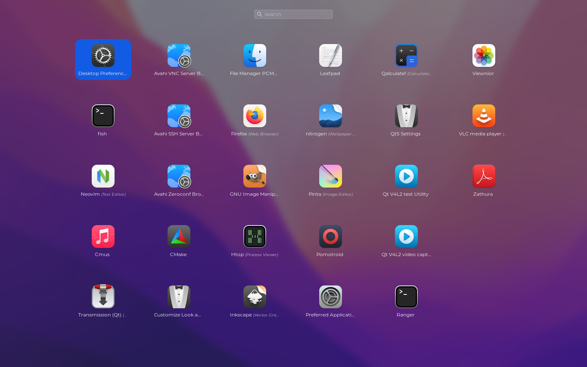
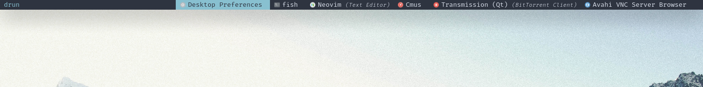
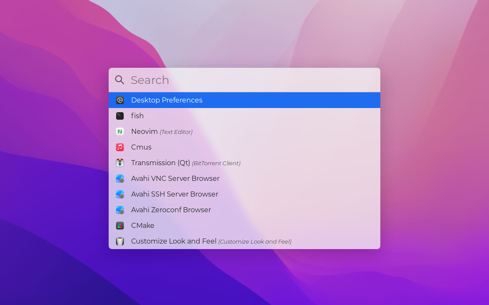
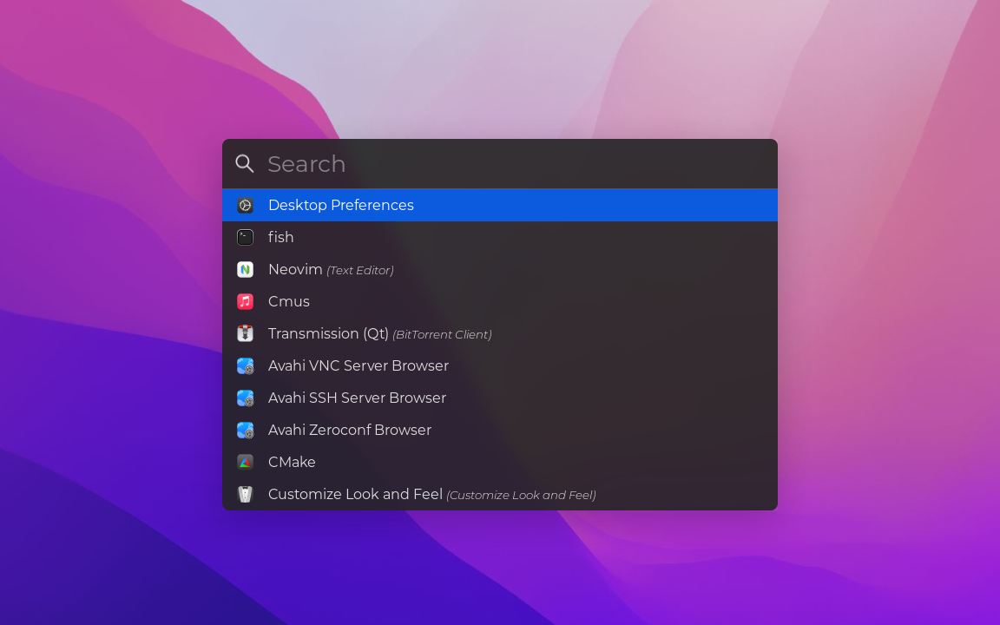

# Themes Collection for Rofi Launcher

## What is Rofi?

Rofi is A window switcher, Application launcher and dmenu replacement.
Rofi started as a clone of simpleswitcher and It has been extended with extra features,
like an application launcher and ssh-launcher, and can act as a drop-in dmenu replacement,
making it a very versatile tool. Rofi, like dmenu, will provide the user with a textual list of
options where one or more can be selected. This can either be running an application, selecting
a window, or options provided by an external script. You can learn more about Rofi [here](https://github.com/davatorium/rofi).

## Screenshots

### Launchpad


### Nord


### Nord (oneline)


### Nord (two lines)


### Rounded


### Spotlight (light)


### Spotlight (dark)


### Squared Everforest


### Squared Nord


### Squared Material Red


## Don't have rofi yet? Install it!

- On Debian / Ubuntu : `apt-get install rofi`
- On Arch / Arch-based : `pacman -S rofi`
- On Fedora : `dnf install rofi`

> You can learn how to set Rofi shortcuts and more [here.](https://github.com/davatorium/rofi)

## Installing themes

1. Clone this repository and change to its directory:
```
$ git clone https://github.com/lr-tech/rofi-themes-collection.git
$ cd rofi-themes-collection
```

2. If you don't have the directories needed for the install create them with:
```
$ mkdir -p ~/.local/share/rofi/themes/
```

3. Copy your desired theme to `~/.local/share/rofi/themes` folder:
```
$ cp themes/<your-selected-theme> ~/.local/share/rofi/themes/
```

4. Run Rofi in `run` modi, then run `rofi-theme-selector`.

5. Search for your desired theme, press `enter` to preview, then `Alt+a` to accept the new theme.

6. Enjoy your new Rofi theme!

